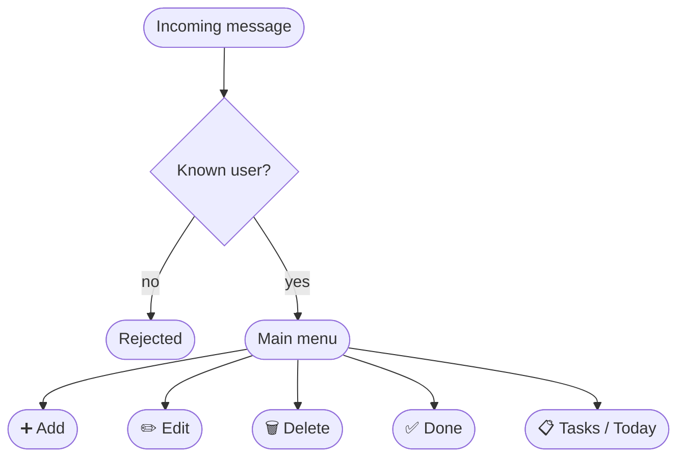
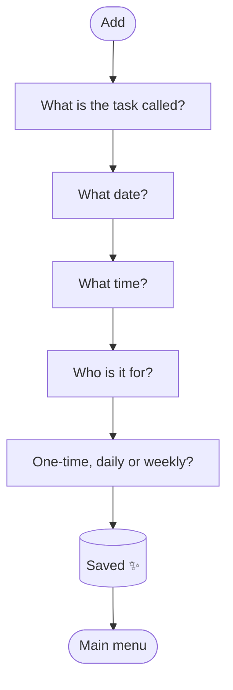
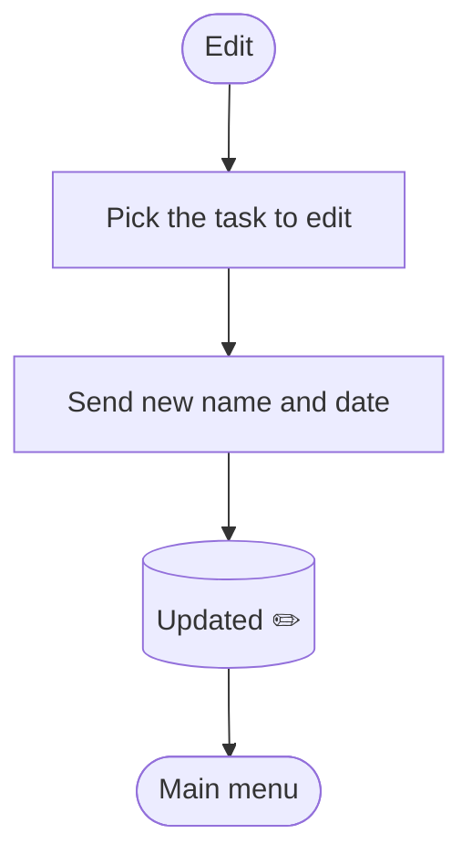
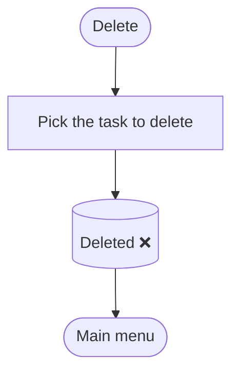
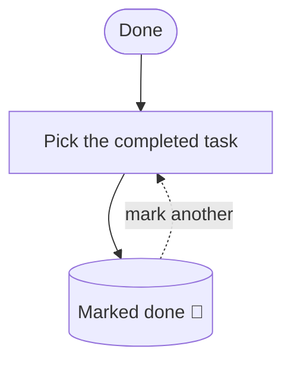
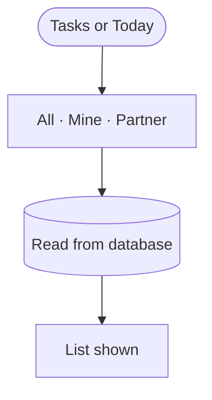

## Routing

```mermaid
flowchart TD
    MSG([Incoming message])
    MSG --> AUTH{Known user?}
    AUTH -- no --> REJECT([Rejected])
    AUTH -- yes --> MAIN([Main menu])
    MAIN --> ADD([➕ Add])
    MAIN --> EDIT([✏️ Edit])
    MAIN --> DELETE([🗑️ Delete])
    MAIN --> DONE([✅ Done])
    MAIN --> VIEWS([📋 Tasks / Today])
```

---

## ➕ Add a task

```mermaid
flowchart TD
    A([Add]) --> a1[What is the task called?]
    a1 --> a2[What date?]
    a2 --> a3[What time?]
    a3 --> a4[Who is it for?]
    a4 --> a5[One-time, daily or weekly?]
    a5 --> a6[(Saved ✨)]
    a6 --> MAIN([Main menu])
```

---

## ✏️ Edit a task

```mermaid
flowchart TD
    E([Edit]) --> e1[Pick the task to edit]
    e1 --> e2[Send new name and date]
    e2 --> e3[(Updated ✏️)]
    e3 --> MAIN([Main menu])
```

---

## 🗑️ Delete a task

```mermaid
flowchart TD
    D([Delete]) --> d1[Pick the task to delete]
    d1 --> d2[(Deleted ❌)]
    d2 --> MAIN([Main menu])
```

---

## ✅ Mark as done

```mermaid
flowchart TD
    DO([Done]) --> do1[Pick the completed task]
    do1 --> do2[(Marked done 💪)]
    do2 -.->|mark another| do1
```

---

## 📋 View tasks

```mermaid
flowchart TD
    V([Tasks or Today]) --> v1[All · Mine · Partner]
    v1 --> v2[(Read from database)]
    v2 --> v3[List shown]
```
