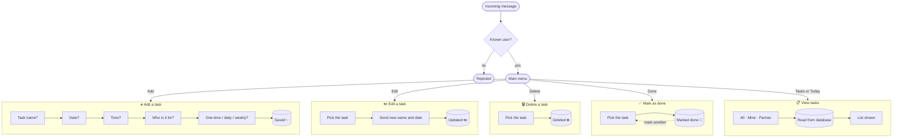

```mermaid
flowchart TD
    MSG([Incoming message]) --> AUTH{Known user?}
    AUTH -- no --> REJECT([Rejected])
    AUTH -- yes --> MAIN([Main menu])

    MAIN -- Add --> ADD
    MAIN -- Edit --> EDIT
    MAIN -- Delete --> DELETE
    MAIN -- Done --> DONE
    MAIN -- Tasks or Today --> VIEWS

    subgraph ADD [➕ Add a task]
        a1[Task name?]
        a1 --> a2[Date?]
        a2 --> a3[Time?]
        a3 --> a4[Who is it for?]
        a4 --> a5[One-time / daily / weekly?]
        a5 --> a6[(Saved ✨)]
    end

    subgraph EDIT [✏️ Edit a task]
        e1[Pick the task]
        e1 --> e2[Send new name and date]
        e2 --> e3[(Updated ✏️)]
    end

    subgraph DELETE [🗑️ Delete a task]
        d1[Pick the task]
        d1 --> d2[(Deleted ❌)]
    end

    subgraph DONE [✅ Mark as done]
        do1[Pick the task]
        do1 --> do2[(Marked done 💪)]
        do2 -.->|mark another| do1
    end

    subgraph VIEWS [📋 View tasks]
        v1[All · Mine · Partner]
        v1 --> v2[(Read from database)]
        v2 --> v3[List shown]
    end
```
